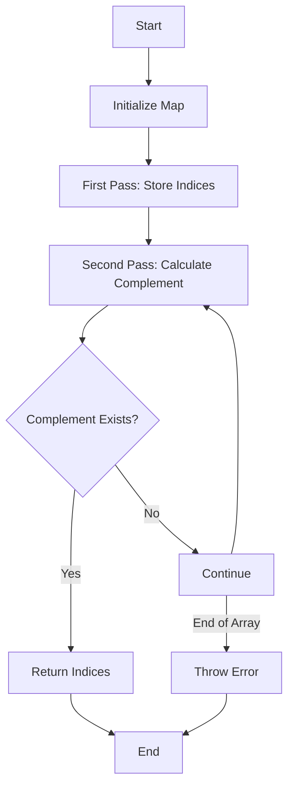

# Concept: Hash Maps & Single-pass Traversal in TypeScript

## 🎯 Learning Objectives

By the end of this lesson, you will:
1. Master the Two Sum problem using TypeScript and Hash Maps
2. Understand time/space complexity trade-offs
3. Learn a reusable pattern for interview problems
4. Practice with interactive examples and test cases

---

### 📝 Problem Statement

```typescript
type TwoSumFunction = (nums: number[], target: number) => [number, number];

/**
 * Given an array of integers and a target sum, return indices of two numbers that add up to the target.
 * @param nums Array of integers
 * @param target Target sum to find
 * @returns Tuple of two indices whose values sum to target
 * @throws Error if no solution exists
 */
```

#### Constraints:
- Exactly one valid solution exists
- Same element cannot be used twice
- Input array length: 2 ≤ n ≤ 10⁴
- Array elements range: -10⁹ ≤ nums[i] ≤ 10⁹
- Target range: -10⁹ ≤ target ≤ 10⁹

#### Example:
```typescript
Input:  nums = [2, 7, 11, 15], target = 9
Output: [0, 1]  // because nums[0] + nums[1] = 2 + 7 = 9
```

---

### 🧮 Solution Approaches

#### 1. Brute Force Approach - O(n²)

```typescript
const twoSumBrute: TwoSumFunction = (nums, target) => {
    for (let i = 0; i < nums.length; i++) {
        for (let j = i + 1; j < nums.length; j++) {
            if (nums[i] + nums[j] === target) {
                return [i, j];
            }
        }
    }
    throw new Error("No solution exists");
};
```

#### 2. Corrected Hash Map Approach - O(n)

```typescript
const twoSum: TwoSumFunction = (nums, target) => {
    const map = new Map<number, number>();
    
    // First pass: store each number's index
    for (let i = 0; i < nums.length; i++) {
        map.set(nums[i], i);
    }

    // Second pass: find the complement
    for (let i = 0; i < nums.length; i++) {
        const complement = target - nums[i];

        if (map.has(complement) && map.get(complement) !== i) {
            return [i, map.get(complement)!];
        }
    }
    
    throw new Error("No solution exists");
};
```

### 🔍 Complexity Analysis

| Approach | Time Complexity | Space Complexity | Pros | Cons |
|----------|----------------|------------------|------|------|
| Brute Force | O(n²) | O(1) | Simple to implement | Slow for large inputs |
| Hash Map | O(n) | O(n) | Linear time | Uses extra space |

---

### 🧪 Test Cases

```typescript
interface TestCase {
    nums: number[];
    target: number;
    expected: [number, number];
    description: string;
}

const testCases: TestCase[] = [
    {
        nums: [2, 7, 11, 15],
        target: 9,
        expected: [0, 1],
        description: "Basic case"
    },
    {
        nums: [-1, -2, -3, -4],
        target: -7,
        expected: [2, 3],
        description: "Negative numbers"
    },
    {
        nums: [3, 3],
        target: 6,
        expected: [0, 1],
        description: "Same numbers"
    },
    {
        nums: [1, 5, 8, 3, 9, 2],
        target: 7,
        expected: [1, 5],
        description: "Numbers in middle and end"
    }
];

// Test runner
function runTests(implementation: TwoSumFunction): void {
    for (const { nums, target, expected, description } of testCases) {
        try {
            const result = implementation(nums, target);
            const passed = result[0] === expected[0] && result[1] === expected[1];
            console.log(`${description}: ${passed ? '✅' : '❌'}`);
        } catch (error) {
            console.error(`${description}: ❌ - ${error.message}`);
        }
    }
}
```

### 🎯 Common Patterns & Techniques

1. **Complement Pattern**
   ```typescript
   complement = target - currentNumber
   ```

2. **Hash Map Lookup Pattern**
   ```typescript
   if (map.has(key)) {
       // Found what we're looking for
   } else {
       map.set(key, value);
   }
   ```

3. **Early Return Pattern**
   ```typescript
   if (condition) return result;
   ```

### 🚀 Performance Optimization Tips

1. **Use Map over Object**
   - `Map` has better performance for frequent additions/removals
   - No prototype chain to worry about
   - Direct key-value storage

2. **Early Exit**
   - Return as soon as solution is found
   - Don't process unnecessary elements

3. **Memory Management**
   - Clear Map when done if reusing
   - Don't store unnecessary data

### 📚 Related Problems

1. **Two Sum II - Input Array is Sorted**
   - Use two pointers instead of hash map
   - O(n) time, O(1) space

2. **3Sum**
   - Fix one number, use Two Sum for the rest
   - O(n²) time complexity

3. **Subarray Sum Equals K**
   - Use running sum with hash map
   - Track cumulative sums

### 🎓 Interview Tips

1. **Always Clarify:**
   - Input constraints
   - Expected output format
   - Edge cases to handle
   - Performance requirements

2. **Solution Steps:**
   1. Explain brute force first
   2. Analyze its limitations
   3. Propose optimized solution
   4. Discuss trade-offs

3. **Code Quality:**
   - Use TypeScript types
   - Add error handling
   - Write clear comments
   - Use descriptive variable names

### 🔗 Resources

1. **Official Documentation**
   - [TypeScript Handbook](https://www.typescriptlang.org/docs/)
   - [Map MDN](https://developer.mozilla.org/en-US/docs/Web/JavaScript/Reference/Global_Objects/Map)

2. **Practice Problems**
   - [LeetCode Two Sum](https://leetcode.com/problems/two-sum/)
   - [HackerRank Challenges](https://www.hackerrank.com/domains/algorithms)

3. **Advanced Reading**
   - [Hash Table Implementation](https://www.geeksforgeeks.org/implementation-of-hash-table-in-typescript/)
   - [Algorithm Complexity](https://www.bigocheatsheet.com/)

### ✅ Checklist

Before submitting your solution, ensure:

- [ ] Solution handles all edge cases
- [ ] Types are properly defined
- [ ] Error cases are handled
- [ ] Code is properly formatted
- [ ] Tests pass
- [ ] Comments are clear and helpful
- [ ] No unnecessary console.logs
- [ ] Performance is optimized

---

### 🎯 Practice Exercise

Implement these variations:
1. Two Sum with sorted input
2. Two Sum with duplicates allowed
3. Two Sum with negative numbers
4. Count pairs that sum to target

Remember to use TypeScript and maintain good coding practices!

---

### 🖼️ Visual Aid: Two Sum Logic Flow

Below is a flowchart illustrating the logic flow of the Two Sum problem using a hash map:

1. **Initialize Map**: Start with an empty map.
2. **First Pass**: Store each number's index in the map.
3. **Second Pass**: For each number, calculate the complement and check if it exists in the map.
4. **Return Indices**: If the complement is found and is not the same index, return the indices.
5. **Error Handling**: If no solution is found, throw an error.



### 🏋️ Additional Practice Problems

1. **3Sum**: Find three numbers in an array that add up to a target sum.
2. **4Sum**: Extend the Two Sum problem to find four numbers that add up to a target sum.
3. **Subarray Sum Equals K**: Find the number of continuous subarrays whose sum equals to k.
4. **Two Sum II - Input Array is Sorted**: Solve the Two Sum problem with a sorted array using two pointers.

### 🧹 Code Quality and Best Practices

- **Descriptive Naming**: Use clear and descriptive variable names, e.g., `complement`, `indexMap`.
- **Error Handling**: Always handle potential errors, such as no solution found.
- **Comments and Documentation**: Add comments to explain complex logic and document functions with JSDoc.
- **Consistent Formatting**: Follow consistent code formatting and style guidelines.
- **Avoid Magic Numbers**: Use constants or variables instead of hardcoding numbers.

### 🔗 Supplementary Resources

- **Video Tutorials**: [NeetCode – Two Sum Explained](https://www.youtube.com/watch?v=KLlXCFG5TnA)
- **Articles**: [GeeksforGeeks – Two Sum Problem](https://www.geeksforgeeks.org/two-sum-problem/)
- **Books**: "Cracking the Coding Interview" by Gayle Laakmann McDowell

---